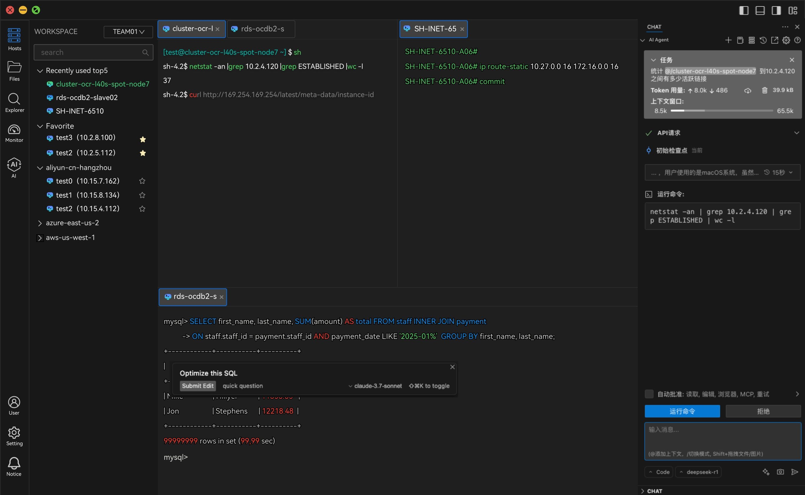
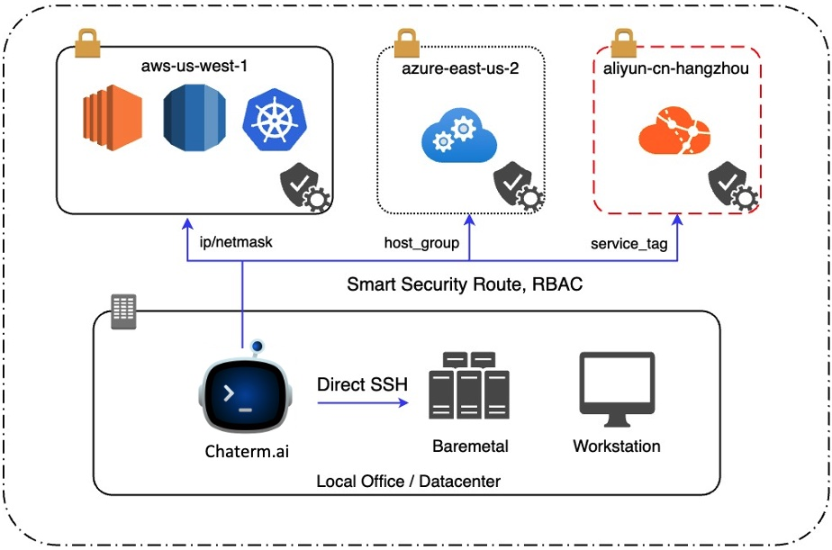

<div align="center">
  <a href="./README_zh.md">中文</a> / English
</div>
<br>
<p align="center">


</p>

# Chaterm

A terminal tool with AI Agent, makes you no need to learn complicated regular expressions, Perl and Python, switches and Linux commands, SQL syntax can easily manage thousands of devices!

Is the full screen of errors difficult to understand? Massive log output, don't know how to locate the problem? Ask Agent with @host directly!

Want syntax highlighting and smart completion, but don't have root privileges, and don't want to install fish thousands of times, use Chaterm to solve it with one click!

## Demo Display



## Usecase



## Main Features

- 🤖️ AI Agent：Use natural language to instead of remember the complex command line.
- ✅ Smart Completion：Command suggestion base your personal knowledge across multiple os platform.
- 💬 Voice Command: High accuracy speech recognition and knowledge base enables input without a keyboard.
- 🌟 Global Syntax Highlight：Personalization syntax highlighting on no matter whatever shell you use.
- 📄 Visual Vim Editor：Get visual text editor experience in terminal Vim like Sublime Text.
- 🎹 Short aliases：instead of complex code snippets across multiple terminal.

## Security Features

- 🔐 Zero Trust：No need to worry about update passwords and SSH certificates monthly again.
- 💼 IAM and Workspace：Make collaboration easier in same team and isolation between different teams.
- 🔏 Privacy watermark：screen recording, Clipboard and data transmission control.
- 🔎 Behavior Audits：Advanced pattern recognition and anomaly detection in user operations.

## Development Guide

Please read the [Contribution Guidelines](./CONTRIBUTING.md)

### Install Electron

```sh
npm i electron -D
```

### Install

```bash
node scripts/patch-package-lock.js
npm install
```

### Development

```bash
npm run dev
```

### Build

```bash
# For windows
npm run build:win

# For macOS
npm run build:mac

# For Linux
npm run build:linux
```

## Contributors

In this era full of unlimited opportunities and challenges, a group of DevOps partners from different backgrounds gathered here with their dreams. They used their spare time to create this ingenious tool.

We hope it will become a reliable partner for you to improve efficiency and quality of life. At the same time, we also look forward to more like-minded friends joining us to create a better future together!
