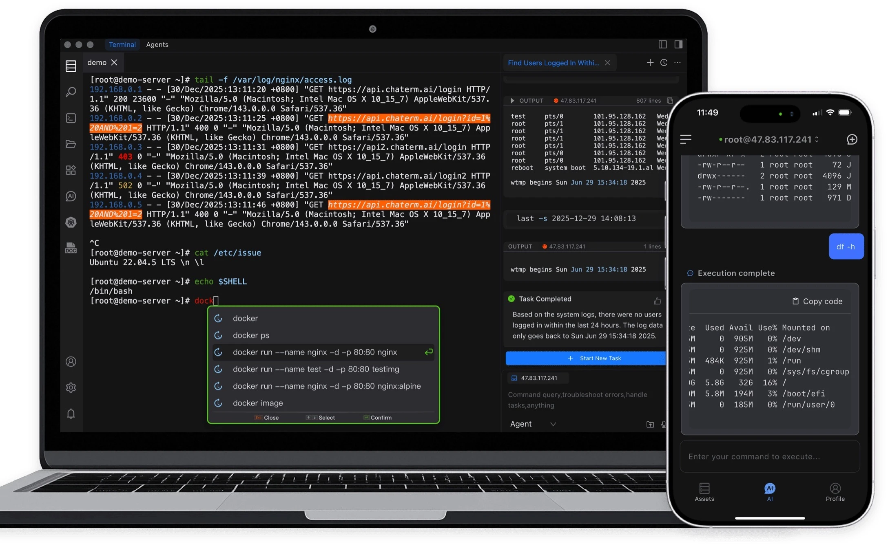
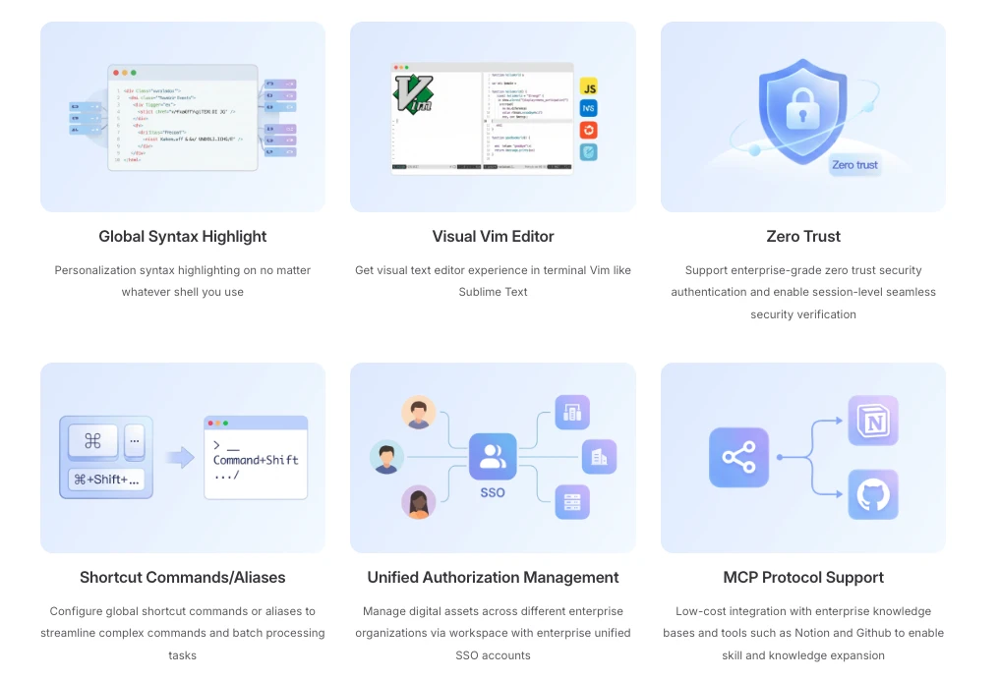

<div align="center">
  <a href="./README_zh.md">中文</a> / <a href="./README.md">English</a> / 日本語
</div>
<br>

<p align="center">
  <a href="https://www.tbench.ai/leaderboard/terminal-bench/1.0"></a>
  <a href="https://aws.amazon.com/cn/blogs/china/chaterm-aws-kms-envelope-encryption-for-zero-trust-security-en/"></a>
  <a href="https://landscape.cncf.io/?item=provisioning--automation-configuration--chaterm"></a>
  <p align="center">
</p>

<p align="center">
  <a href="https://github.com/chaterm/Chaterm/releases"></a>
  <a href="https://www.electronjs.org/"></a>
  <a href="https://vitejs.dev/"></a>
  <a href="https://vuejs.org/"></a>
  <a href="https://www.typescriptlang.org/"></a>
</p>

<p align="center">
  <a href="https://chaterm.ai/download/"></a>
  <a href="https://chaterm.ai/download/"></a>
  <a href="https://chaterm.ai/download/"></a>
  <a href="https://apps.apple.com/us/app/chaterm/id6754307456"></a>
  <a href="https://play.google.com/store/apps/details?id=com.intsig.chaterm.global"></a>
  <a href="https://aws.amazon.com/marketplace/"></a>
  <p align="center">
</p>

# 製品紹介

Chaterm: 次世代AIターミナルコパイロット!

Chatermは、自然言語インタラクションを通じて従来のコマンドライン操作体験を再構築することを目的としたAIネイティブのインテリジェントターミナルエージェントです。単なるダイアログ付きSSHクライアントではなく、あなたのインテリジェントなDevOpsコパイロットになることを目指しています。

内蔵の専門知識ベースと強力なエージェント推論機能により、Chatermはあなたのビジネストポロジーと操作意図を理解します。複雑なシェルコマンド、SQL構文、スクリプトパラメータを覚える必要はなく、自然言語でコードビルド、サービスデプロイ、障害対応、自動ロールバックなどの一連の操作を自動的に完了できます。Chatermは技術スタックの認知障壁を解消し、すべての開発者がベテランSREの運用能力を即座に手に入れることを目指しています。



## 主な機能

- 🤖 **AIエージェントアシスタント**

  複雑なO&Mタスクを実行可能なステップに分割し、ログ分析からサービスのロールバックまで、クローズドループAI実行によって操作を自動化します。

- 🧠 **インテリジェントコマンド推奨**

  過去のコマンドを記録するだけでなく、ユーザーの習慣、現在のインフラストラクチャ環境、マルチサーバーのコンテキストに基づいて、最適なコマンドをリアルタイムで推奨します。

- 🎙️ **音声および会話による操作**

  モバイルデバイス上で音声および会話によるインタラクションでコマンドを実行できるため、仮想キーボードの制限がなくなり、リモートO&Mや緊急障害対応のシナリオに特に適しています。

- 🎨 **モダンターミナルエクスペリエンス**

  テーマ、設定、構文の強調表示をデバイス間で自動的に同期します。WinSCPに似た、ビジュアルなVim編集、多言語構文の強調表示、ホスト間のファイル同期をサポートします。

- 🧩 **ナレッジベース + エージェントスキル**

  長期記憶をサポートし、技術マニュアル、社内文書、スクリプトをインポートして個人用のナレッジベースを構築できます。エージェントスキルを組み合わせることで、実際の運用・保守シナリオにおいてAIのインテリジェント性と信頼性を高めることができます。

- 🛡️ **ゼロトラスト・セキュリティ・アーキテクチャ**

  エンタープライズグレードのセキュリティ設計を組み込み、セッションレベルのID認証を通じて、すべての操作が監査可能、追跡可能、そしてゼロトラスト・セキュリティ・フレームワークに準拠していることを保証します。

- 🔌 **プラグイン・エコシステム**

  プラグインを通じて機能を拡張し、パブリッククラウド、ネットワークデバイス、コンテナ、Kubernetesを統合管理できます。IAMアクセス制御と組み合わせることで、統合認証とインフラ資産の一元管理を実現します。



## 開発ガイド

### Electronのインストール

```sh
npm i electron -D
```

### インストール

```bash
node scripts/patch-package-lock.js
npm install
```

### 開発

```bash
npm run dev
```

### ビルド

```bash
# Windows向け
npm run build:win

# macOS向け
npm run build:mac

# Linux向け
npm run build:linux
```

## コントリビューター

Chatermへの貢献ありがとうございます！
詳細については<a href="./CONTRIBUTING.md">貢献ガイド</a>をご参照ください。

<div align=center style="margin-top: 30px;">
  <a href="https://github.com/chaterm/Chaterm/graphs/contributors">
    
  </a>
</div>
