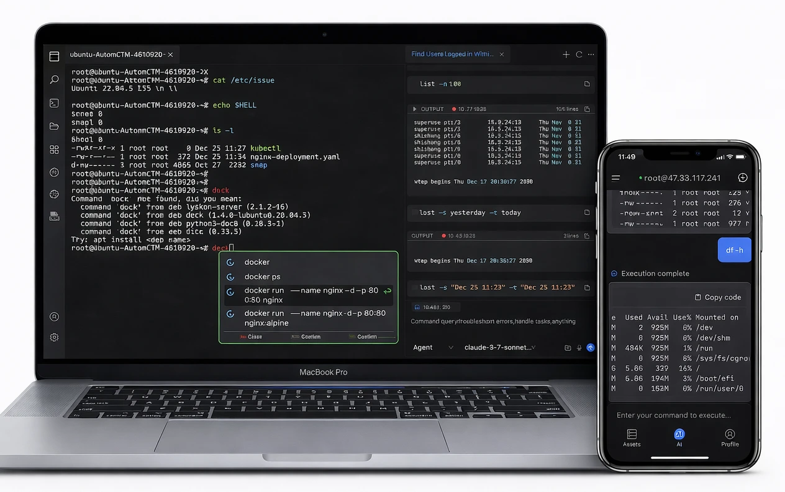
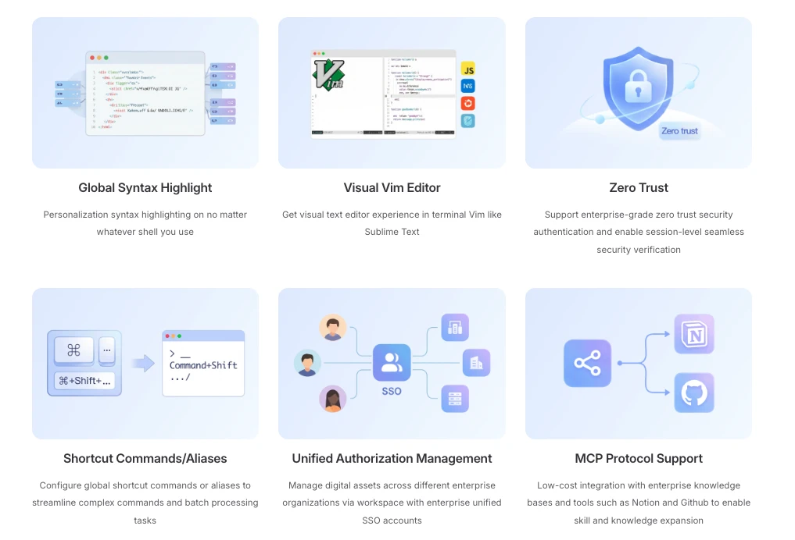

<div align="center">
  中文 / <a href="./README.md">English</a> 
</div>
<br>

<p align="center">
  <a href="https://www.tbench.ai/leaderboard/terminal-bench/1.0">
    
  </a>
  <a href="https://landscape.cncf.io/">
    
  </a>
</p>
<p align="center">


</p>
<p align="center">
  <a href="https://chaterm.ai/download/">
  
  </a>
  <a href="https://chaterm.ai/download/">
  
  </a>
  <a href="https://chaterm.ai/download/">
  
  </a>
  <a href="https://apps.apple.com/us/app/chaterm/id6754307456">
  
  </a>
  <a href="https://play.google.com/store/apps/details?id=com.intsig.chaterm.global">
  
  </a>
</p>

# 产品介绍

Chaterm: 您的下一代AI终端副驾驶!

Chaterm是一款AI原生的智能终端Agent，旨在通过自然语言交互重构传统的命令行操作体验。它的目标是成为您的DevOps智能副驾驶，而非仅仅是一个带对话框的SSH客户端。

通过内置的专家知识库与强大的 Agent 推理能力，Chaterm能够理解您的业务拓扑与操作意图。无需记忆复杂的 Shell 指令、SQL 语法或脚本参数，即可通过自然语言自动完成代码构建、服务部署、故障排查及自动回滚等全链路操作。Chaterm 致力于消除技术栈的认知门槛，让每一位开发者都能即刻拥有资深SRE的运维能力。



## 核心特性

- 🤖 自主 Agent 引擎 具备复杂任务的拆解与规划能力，支持从日志分析到服务回滚的闭环自动化操作。

- 🧠 智能语境补全 超越传统历史记录，基于用户操作习惯、当前业务上下文及跨服务器环境，提供更懂你的智能命令建议。

- 🎙️ 语音即时交互 打破键盘限制，支持移动端的语音指令输入，大幅提升远程运维与应急响应效率。

- 🎨 全局一致性体验 配置漫游：一次配置语法高亮与环境偏好，任意主机登录即可自动同步。 可视化 Vim：在终端内提供类 IDE 的现代化文件编辑体验，支持多语言语法高亮。

- 🛡️ 企业级零信任安全 集成会话级无感知认证体系，全面支持零信任安全架构，确保每一次操作都合规可溯。

- 🔗 MCP 协议生态 全面支持 Model Context Protocol (MCP)，可低成本接入 Notion、GitHub 等企业知识库，实现 AI 技能的无限扩展。

- 🏢 统一工作空间 支持 Alias 快捷指令共享与企业级 SSO 统一授权，高效管理跨组织的数字资产。



## 开发指南

### Install Electron

```sh
1、更换npm源为最新淘宝源
npm config set registry https://registry.npmmirror.com

2、编辑npm 配置文件
npm config edit

3、在打开的配置文件中，添加以下镜像源配置：
electron_mirror=https://cdn.npmmirror.com/binaries/electron/
electron_builder_binaries_mirror=https://npmmirror.com/mirrors/electron-builder-binaries/

4、保存并关闭配置文件后，在命令行中安装 Electron：
npm i electron -D

```

### Install

```bash
node scripts/patch-package-lock.js
npm install
```

### Development

```bash
npm run dev
```

### Build

```bash
# For windows
npm run build:win

# For macOS
npm run build:mac

# For Linux
npm run build:linux
```

## Contributors

感谢您为Chaterm做出贡献！请参阅<a href="./CONTRIBUTING_zh.md">贡献指南</a>获取更多信息。

