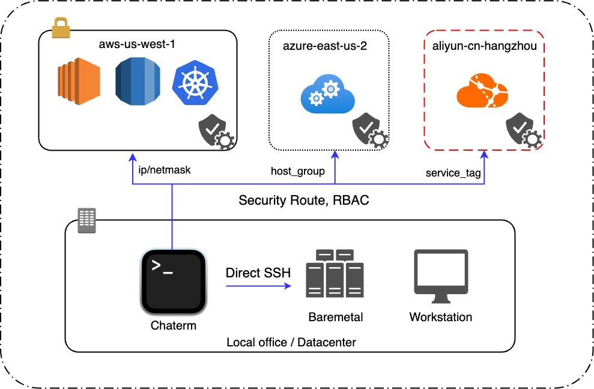

<div align="center">
  中文 / <a href="./README.md">English</a> 
</div>
<br>
<p align="center">


</p>

# Chaterm

Chaterm是一款类似Cursor的终端上工具，无需再学习复杂的正则表达式，Perl和Python，交换机和Linux命令，SQL语法也能轻松管理上千台设备！

满屏的报错难以理解？海量的日志输出不知道如何定位问题？直接@host提问吧！

想要语法高亮和智能补全，无奈没有root权限，也不想安装几千次fish，使用Chaterm一键解决！

## Demo 展示


## 部署架构



## 核心功能

- 🤖️ 智能Agent：那些复杂又低频的操作命令想不起来？Agent帮你使用自然语言管理机器！
- ✅ 智能补全：基于个人知识库和操作习惯的智能命令补全，跨服务器，跨平台补全！
- 🌟 全局语法高亮：全局语法高亮规则，无论在何种操作系统上均能获得一致的语法高亮体验！
- 📄 可视化VIM：终端上的Sublime Text，支持语法高亮，所见即所得的增强VIM！
- 🎹 全局别名：可配置的全局Alias，给复杂的命令和批处理脚本设置一个简单的别名吧！

## 安全功能

- 🔐 零信任认证：支持零信任认证，无需定期更新密码，也无需在担心密钥丢失，服务器更安全！
- 💼 IAM和工作空间：统一身份凭据和授权管理，通过工作空间使用统一账号管理不同部门和事业部中的IT数字资产！
- 🔏 隐私水印：支持隐私水印，屏幕录制，剪贴板控制，数据传输控制等！
- 🔎 全局行为审计：全局日志审计和异常行为安全检查，保障您的资产安全！

## Project Setup

### Install Electron

```sh
1、更换npm源为最新淘宝源
npm config set registry https://registry.npmmirror.com

2、编辑npm 配置文件
npm config edit

3、在打开的配置文件中，添加以下镜像源配置：
electron_mirror=https://cdn.npmmirror.com/binaries/electron/
electron_builder_binaries_mirror=https://npmmirror.com/mirrors/electron-builder-binaries/

4、保存并关闭配置文件后，在命令行中安装 Electron：
npm i electron -D

```

### Install

```bash
$ npm install
```

### Development

```bash
$ npm run dev
```

### Build

```bash
# For windows
$ npm run build:win

# For macOS
$ npm run build:mac

# For Linux
$ npm run build:linux
```

### 本地前后端调试

<p>打开electron.vite.config.ts文件，将target指向改为本地url地址即可。</p>

## Contributors

在这个充满无限机遇和挑战时代，一群不同背景的DevOps小伙伴，怀揣梦想汇聚于此。利用业余时间打造了这款匠心独运的工具。
希望它成为您提升效率、改善生活品质的可靠伙伴。同时也期待更多志同道合的朋友加入我们，携手共创美好未来！
